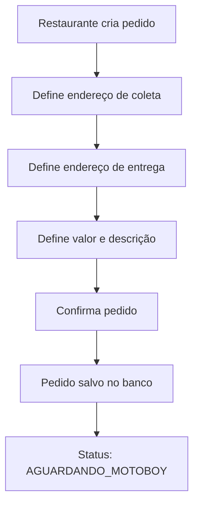
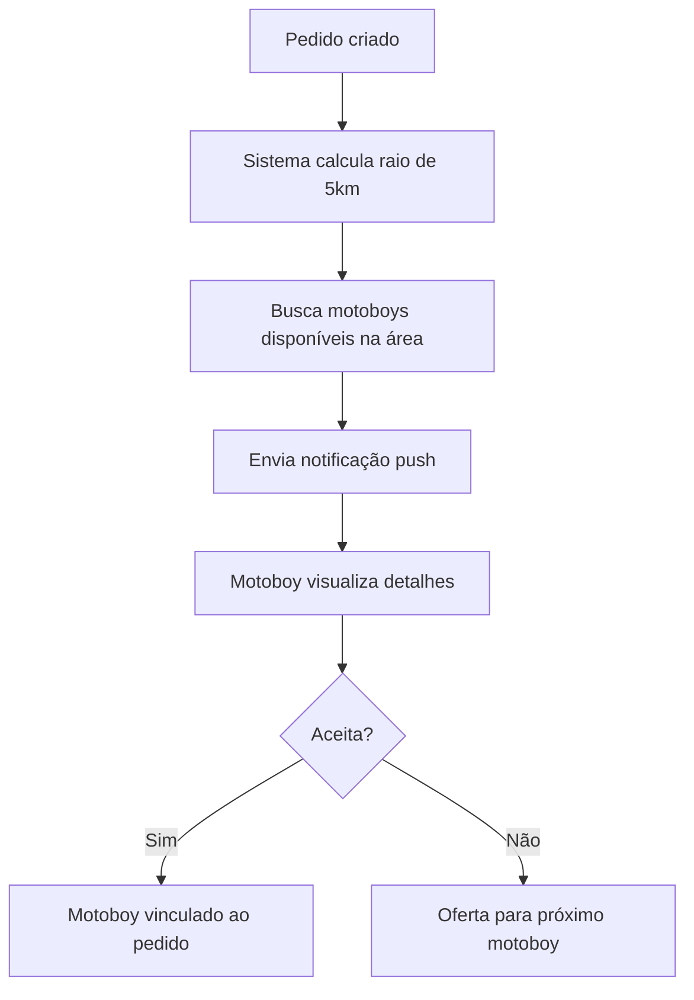
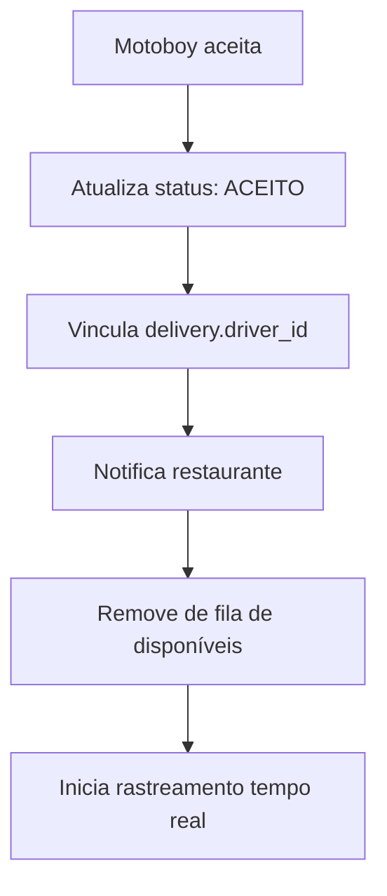
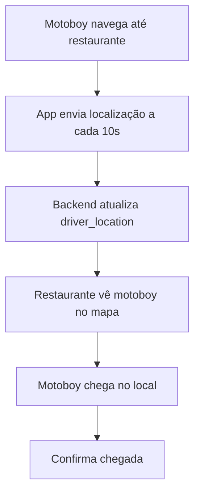
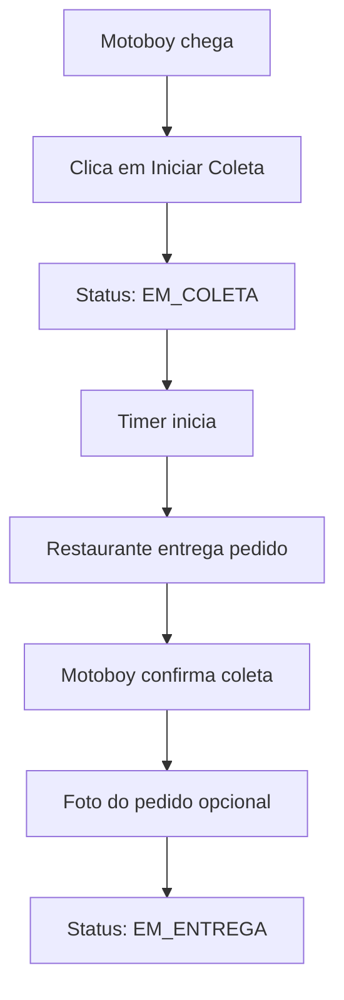
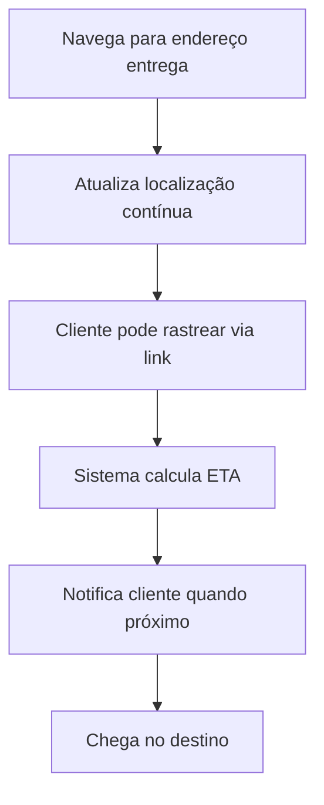
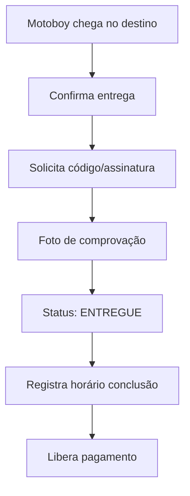
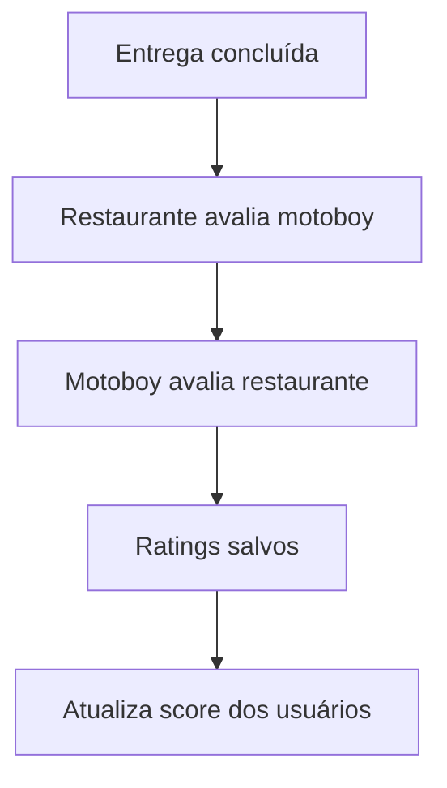

# Fluxo Completo do Aplicativo Movvi

## 📱 Visão Geral dos Aplicativos

### 1. **App Web - Restaurante/Loja**
- Painel para criar e gerenciar pedidos de entrega
- Visualizar status em tempo real
- Histórico de entregas
- Gestão financeira

### 2. **App Mobile - Motoboy** 
- Receber notificações de novas entregas
- Aceitar/recusar pedidos
- Navegação GPS até local
- Confirmar retirada e entrega
- Ganhos e histórico

### 3. **Painel Admin Web**
- Gerenciar usuários (motoboys, restaurantes)
- Monitorar entregas em tempo real
- Analytics e relatórios
- Gestão de disputas
- Configurações da plataforma

---

## 🔄 Fluxo Completo de Entrega

### **Fase 1: Criação do Pedido**



**Backend:**
- Tabela `deliveries` recebe novo registro
- Trigger notifica motoboys disponíveis na região
- Sistema calcula distância e valor sugerido

**Dados Salvos:**
```sql
deliveries {
  id: uuid
  restaurant_id: uuid
  pickup_address: jsonb
  delivery_address: jsonb
  distance_km: decimal
  suggested_price: decimal
  description: text
  status: enum ('aguardando', 'aceito', 'em_coleta', 'em_entrega', 'entregue', 'cancelado')
  created_at: timestamp
}
```

---

### **Fase 2: Notificação aos Motoboys**



**Backend:**
- Realtime subscription em `deliveries` 
- Edge Function envia push notifications
- Sistema de fila para ofertas

**Push Notification:**
```json
{
  "title": "Nova Entrega Disponível",
  "body": "R$ 15,00 - 3.5km - Restaurante Sabor Caseiro",
  "data": {
    "delivery_id": "uuid",
    "pickup_location": {...},
    "delivery_location": {...}
  }
}
```

---

### **Fase 3: Aceitação pelo Motoboy**



**Backend:**
```sql
UPDATE deliveries 
SET 
  driver_id = 'motoboy_uuid',
  status = 'aceito',
  accepted_at = NOW()
WHERE id = 'delivery_uuid';
```

**Realtime:**
- Canal específico para delivery: `delivery:{id}`
- Restaurante recebe atualização via websocket
- Admin vê mudança no dashboard

---

### **Fase 4: Deslocamento para Coleta**



**Backend - Realtime Location:**
```sql
-- Tabela de rastreamento
driver_locations {
  driver_id: uuid
  delivery_id: uuid
  latitude: decimal
  longitude: decimal
  updated_at: timestamp
}
```

**Mobile - Envio de Localização:**
```typescript
// A cada 10 segundos
const updateLocation = async (lat: number, lng: number) => {
  await supabase
    .from('driver_locations')
    .upsert({
      driver_id: driverId,
      delivery_id: deliveryId,
      latitude: lat,
      longitude: lng,
      updated_at: new Date()
    });
};
```

---

### **Fase 5: Coleta no Restaurante**



**Backend:**
```sql
UPDATE deliveries 
SET 
  status = 'em_coleta',
  pickup_started_at = NOW()
WHERE id = 'delivery_uuid';

-- Após confirmação
UPDATE deliveries 
SET 
  status = 'em_entrega',
  pickup_confirmed_at = NOW(),
  pickup_photo_url = 'storage_url'
WHERE id = 'delivery_uuid';
```

---

### **Fase 6: Deslocamento para Entrega**



**Backend - ETA Calculation:**
```typescript
// Edge Function
const calculateETA = (currentLocation, destination) => {
  // Usa API de rotas (Google Maps, Mapbox)
  // Calcula tempo estimado considerando trânsito
  // Retorna minutos estimados
};
```

**Realtime para Cliente:**
```typescript
// Cliente pode acessar tracking via link público
const channel = supabase
  .channel(`delivery:${deliveryId}:public`)
  .on('postgres_changes', {
    event: 'UPDATE',
    schema: 'public',
    table: 'driver_locations',
    filter: `delivery_id=eq.${deliveryId}`
  }, (payload) => {
    updateMapMarker(payload.new);
  })
  .subscribe();
```

---

### **Fase 7: Entrega Final**



**Backend:**
```sql
UPDATE deliveries 
SET 
  status = 'entregue',
  delivered_at = NOW(),
  delivery_photo_url = 'storage_url',
  delivery_code = 'codigo_confirmacao'
WHERE id = 'delivery_uuid';

-- Trigger automático para pagamento
CREATE OR REPLACE FUNCTION process_delivery_payment()
RETURNS TRIGGER AS $$
BEGIN
  IF NEW.status = 'entregue' THEN
    INSERT INTO transactions (
      delivery_id,
      driver_id,
      restaurant_id,
      amount,
      platform_fee,
      driver_earning,
      status
    ) VALUES (
      NEW.id,
      NEW.driver_id,
      NEW.restaurant_id,
      NEW.suggested_price,
      NEW.suggested_price * 0.15, -- 15% taxa plataforma
      NEW.suggested_price * 0.85,  -- 85% para motoboy
      'processando'
    );
  END IF;
  RETURN NEW;
END;
$$ LANGUAGE plpgsql;
```

---

### **Fase 8: Avaliação e Feedback**



**Backend:**
```sql
ratings {
  id: uuid
  delivery_id: uuid
  rater_id: uuid (quem avalia)
  rated_id: uuid (quem é avaliado)
  rating: integer (1-5)
  comment: text
  created_at: timestamp
}
```

---

## 🗄️ Estrutura Completa do Banco de Dados

### **Tabelas Principais:**

```sql
-- Usuários
profiles {
  id: uuid (references auth.users)
  full_name: text
  phone: text
  avatar_url: text
  user_type: enum ('driver', 'restaurant', 'admin')
  created_at: timestamp
}

-- Motoboys
drivers {
  id: uuid (references profiles)
  vehicle_type: text
  vehicle_plate: text
  cnh_number: text
  status: enum ('available', 'busy', 'offline')
  current_location: point
  rating_avg: decimal
  total_deliveries: integer
  verification_status: enum ('pending', 'approved', 'rejected')
}

-- Restaurantes
restaurants {
  id: uuid (references profiles)
  business_name: text
  cnpj: text
  address: jsonb
  rating_avg: decimal
  total_orders: integer
  verification_status: enum ('pending', 'approved', 'rejected')
}

-- Entregas
deliveries {
  id: uuid
  restaurant_id: uuid
  driver_id: uuid
  pickup_address: jsonb
  delivery_address: jsonb
  distance_km: decimal
  suggested_price: decimal
  actual_price: decimal
  description: text
  special_instructions: text
  status: enum
  pickup_photo_url: text
  delivery_photo_url: text
  created_at: timestamp
  accepted_at: timestamp
  pickup_started_at: timestamp
  pickup_confirmed_at: timestamp
  delivered_at: timestamp
  cancelled_at: timestamp
  cancellation_reason: text
}

-- Localização em tempo real
driver_locations {
  driver_id: uuid
  delivery_id: uuid
  latitude: decimal
  longitude: decimal
  heading: decimal
  speed: decimal
  updated_at: timestamp
}

-- Transações financeiras
transactions {
  id: uuid
  delivery_id: uuid
  driver_id: uuid
  restaurant_id: uuid
  amount: decimal
  platform_fee: decimal
  driver_earning: decimal
  restaurant_charge: decimal
  status: enum ('pending', 'processing', 'completed', 'failed')
  processed_at: timestamp
}

-- Avaliações
ratings {
  id: uuid
  delivery_id: uuid
  rater_id: uuid
  rated_id: uuid
  rating: integer
  comment: text
  created_at: timestamp
}

-- Notificações
notifications {
  id: uuid
  user_id: uuid
  title: text
  body: text
  type: enum ('new_delivery', 'delivery_accepted', 'delivery_completed', 'payment', 'system')
  data: jsonb
  read: boolean
  created_at: timestamp
}

-- Disputas
disputes {
  id: uuid
  delivery_id: uuid
  reporter_id: uuid
  reported_id: uuid
  reason: text
  description: text
  status: enum ('open', 'investigating', 'resolved', 'closed')
  resolution: text
  created_at: timestamp
  resolved_at: timestamp
}
```

---

## 🔐 Segurança e RLS Policies

### **Políticas de Acesso:**

```sql
-- Motoboys só veem seus próprios dados
CREATE POLICY "Drivers view own data"
ON drivers FOR SELECT
USING (auth.uid() = id);

-- Restaurantes veem apenas suas entregas
CREATE POLICY "Restaurants view own deliveries"
ON deliveries FOR SELECT
USING (restaurant_id IN (
  SELECT id FROM profiles WHERE id = auth.uid()
));

-- Motoboys veem entregas disponíveis na região
CREATE POLICY "Drivers view available deliveries"
ON deliveries FOR SELECT
USING (
  status = 'aguardando' 
  AND ST_DWithin(
    pickup_address::geography,
    (SELECT current_location FROM drivers WHERE id = auth.uid()),
    5000 -- 5km radius
  )
);

-- Admin vê tudo
CREATE POLICY "Admin view all"
ON deliveries FOR ALL
USING (
  EXISTS (
    SELECT 1 FROM user_roles 
    WHERE user_id = auth.uid() 
    AND role = 'admin'
  )
);
```

---

## 📱 Funcionalidades do App Mobile (Motoboy)

### **Telas Principais:**

1. **Home / Disponível**
   - Toggle online/offline
   - Resumo de ganhos do dia
   - Botão "Buscar Entregas"

2. **Lista de Entregas Disponíveis**
   - Cards com informações resumidas
   - Distância, valor, tempo estimado
   - Filtros (distância, valor mínimo)

3. **Detalhes da Entrega**
   - Mapa com origem e destino
   - Informações completas
   - Botão "Aceitar Entrega"

4. **Entrega Ativa**
   - Mapa com navegação GPS
   - Status atual (indo para coleta, em entrega)
   - Botões de ação contextuais
   - Timer de duração

5. **Histórico**
   - Lista de entregas passadas
   - Filtros por data, status
   - Detalhes e comprovantes

6. **Carteira**
   - Saldo disponível
   - Histórico de pagamentos
   - Solicitar saque

7. **Perfil**
   - Dados pessoais
   - Documentos
   - Avaliações recebidas
   - Configurações

---

## 💻 Funcionalidades do Painel Web (Restaurante)

### **Módulos:**

1. **Dashboard**
   - Entregas do dia
   - Gráficos de volume
   - Custos totais
   - Entregas em andamento (mapa)

2. **Nova Entrega**
   - Formulário completo
   - Seleção no mapa
   - Cálculo automático de distância/valor
   - Instruções especiais

3. **Entregas Ativas**
   - Lista com rastreamento
   - Status em tempo real
   - Chat com motoboy

4. **Histórico**
   - Tabela paginada
   - Filtros avançados
   - Exportar relatórios
   - Detalhes e comprovantes

5. **Financeiro**
   - Resumo de gastos
   - Faturas
   - Formas de pagamento
   - Relatórios fiscais

6. **Configurações**
   - Dados do estabelecimento
   - Endereços salvos
   - Preferências de entrega
   - Integrações

---

## 👨‍💼 Painel Admin

### **Módulos de Administração:**

1. **Dashboard Geral**
   - Métricas em tempo real
   - Entregas ativas no mapa
   - Alertas e problemas
   - Gráficos de crescimento

2. **Gestão de Usuários**
   - Lista de motoboys
   - Lista de restaurantes
   - Verificação de documentos
   - Aprovar/rejeitar cadastros
   - Suspender contas

3. **Monitoramento de Entregas**
   - Todas entregas em andamento
   - Detalhes completos
   - Rastreamento no mapa
   - Intervenção manual

4. **Disputas e Suporte**
   - Lista de disputas abertas
   - Sistema de tickets
   - Resolução de problemas
   - Reembolsos manuais

5. **Financeiro**
   - Receita total
   - Comissões cobradas
   - Pagamentos pendentes
   - Relatórios contábeis

6. **Analytics**
   - Métricas de performance
   - Taxa de conclusão
   - Tempo médio de entrega
   - Satisfação dos usuários
   - Regiões mais ativas

7. **Configurações**
   - Taxas e comissões
   - Raio de busca de motoboys
   - Regras de negócio
   - Notificações do sistema

---

## 🚀 Edge Functions Necessárias

```typescript
// 1. notify-drivers
// Notifica motoboys disponíveis sobre nova entrega

// 2. calculate-delivery-price
// Calcula valor sugerido baseado em distância

// 3. process-payment
// Processa pagamento após entrega concluída

// 4. send-push-notification
// Envia notificações push via Firebase/OneSignal

// 5. generate-delivery-report
// Gera relatórios em PDF para restaurantes

// 6. verify-documents
// Integração com APIs de verificação de CNH/CNPJ

// 7. calculate-eta
// Calcula tempo estimado usando API de mapas

// 8. handle-dispute
// Lógica de tratamento de disputas
```

---

## 🔔 Sistema de Notificações

### **Eventos que Geram Notificações:**

| Evento | Destinatário | Tipo |
|--------|-------------|------|
| Nova entrega criada | Motoboys na região | Push + In-app |
| Entrega aceita | Restaurante | Push + In-app + Email |
| Motoboy chegou para coleta | Restaurante | Push + In-app |
| Coleta confirmada | Restaurante | In-app |
| Entrega em andamento | Cliente (via link) | SMS |
| Entrega concluída | Restaurante + Motoboy | Push + In-app |
| Pagamento processado | Motoboy | Push + In-app |
| Solicitação de avaliação | Ambos | In-app |
| Disputa aberta | Admin | Email + In-app |

---

## 📊 Métricas de Sucesso

### **KPIs Principais:**

- **Tempo médio de aceite** (meta: < 2 minutos)
- **Taxa de conclusão** (meta: > 95%)
- **Tempo médio de entrega** (meta: < 40 minutos)
- **Rating médio motoboys** (meta: > 4.5)
- **Rating médio restaurantes** (meta: > 4.5)
- **Número de entregas/dia**
- **Receita por entrega**
- **Taxa de cancelamento** (meta: < 5%)

---

## 🔄 Fluxos Alternativos

### **Cancelamento pelo Restaurante:**
1. Restaurante cancela antes de aceite → Sem custo
2. Restaurante cancela após aceite → Taxa de cancelamento
3. Motoboy recebe compensação parcial

### **Cancelamento pelo Motoboy:**
1. Antes da coleta → Penalidade leve
2. Após coleta → Penalidade severa + bloqueio temporário
3. Entrega retorna para fila

### **Problemas na Entrega:**
1. Cliente não encontrado → Timer de espera (10min)
2. Endereço incorreto → Contato com restaurante
3. Recusa do cliente → Procedimento de devolução
4. Acidente/problema → Abertura de disputa

---

## 🎯 Roadmap de Implementação

### **Fase 1 - MVP (4-6 semanas)**
- ✅ Autenticação e perfis
- ✅ CRUD de entregas
- ✅ Aceite e recusa por motoboy
- ✅ Rastreamento básico
- ✅ Conclusão de entrega
- ✅ Painel admin básico

### **Fase 2 - Melhorias (3-4 semanas)**
- 📱 App mobile nativo
- 🔔 Notificações push
- 💰 Sistema de pagamentos
- ⭐ Avaliações
- 📊 Analytics básico

### **Fase 3 - Avançado (4-6 semanas)**
- 🗺️ Otimização de rotas
- 🤖 IA para previsão de demanda
- 💬 Chat em tempo real
- 📸 Reconhecimento de imagens
- 🔒 Verificação avançada

### **Fase 4 - Escala (Contínuo)**
- 🌎 Multi-região
- 🏪 Integrações com ERPs
- 📱 Widgets para sites
- 🔗 APIs públicas
- 🎨 White-label para parceiros
